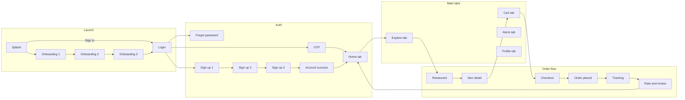

# Savor Food App — Beginner Guide

The app uses a **professional design system**: Playfair Display (titles), DM Sans (body), Ionicons, shared buttons/inputs, and consistent orange/cream colors.

You already built **most** of the screens from your Figma/design images. This guide explains **what you used**, **how screens connect**, and **what is still simple vs. full design**.

---

## What you are building

A food delivery app called **Savor** with:

1. Splash + onboarding (4 screens)
2. Login / OTP / forgot password (3 screens)
3. Sign up in 3 steps + success (4 screens)
4. Main app with bottom tabs: Home, Explore, Cart, Alerts, Profile (4 tabs)
5. Order flow: Restaurant → Item → Cart → Checkout → Order placed → Tracking → Review (7 screens)

You do **not** need to finish every pixel on day one. Focus on **navigation first**, then polish each screen.

---

## Technologies used (nothing extra required)

| Tool | What it does | In your project |
|------|----------------|-----------------|
| **React Native** | Builds iOS/Android UI with `View`, `Text`, `TextInput` | All `.js` screens in `src/app/` |
| **Expo** | Easier setup, run on phone with Expo Go | `package.json`, `npx expo start` |
| **Expo Router** | **File = route** — `login.js` → open `/login` | `expo-router`, folder `src/app/` |
| **React `useState`** | Remember form text, selected chips, tabs | `login.js`, `signup2.js`, `tabs/home.js` |
| **`useRouter()`** | Go to another screen | `router.push('/login')` |
| **`TouchableOpacity`** | Buttons and tappable rows | Every “Continue”, “Sign in”, cards |
| **`StyleSheet`** | Colors, padding, borders | Bottom of each screen file |
| **`ScrollView`** | Scroll when content is tall | `tabs/home.js` |
| **`Tabs` (Expo Router)** | Bottom navigation bar | `src/app/tabs/_layout.js` |
| **Google Fonts** | Serif + sans typography | `@expo-google-fonts/playfair-display`, `dm-sans` |
| **Ionicons** | Tab bar, social login, UI icons | `@expo/vector-icons` |
| **Shared components** | Buttons, inputs, cards | `src/components/savor/` |

You are **not** using Redux, Firebase, or a backend yet — that is normal for learning UI first.

---

## How navigation works (Expo Router)

```
src/app/index.js          →  /           (Splash)
src/app/login.js          →  /login
src/app/tabs/home.js      →  /tabs/home
src/app/restaurant.js     →  /restaurant
```

- **`router.push('/login')`** — open screen and keep history (Back works).
- **`router.replace('/tabs/home')`** — replace current screen (good after login).

**Rule:** File name = URL path. Folder `tabs/` = routes under `/tabs/...`.

---

## Full UI flow (matches your design images)



---

## Screen checklist

| # | Design label | File | Status |
|---|--------------|------|--------|
| 01 | Splash | `src/app/index.js` | Done |
| 02–04 | Onboarding | `onboarding1.js` … `onboarding3.js` | Done |
| 05 | Login | `login.js` | Done — polish buttons |
| 06 | OTP | `otp.js` | Done |
| 07 | Forgot password | `forgot.js` | Done |
| 08–10 | Sign up steps | `signup1.js` … `signup3.js` | Done |
| 11 | Account created | `success.js` | Done |
| 12 | Home | `tabs/home.js` | Done |
| 13 | Explore | `tabs/explore.js` | Basic — links to restaurant |
| 14 | Notifications | `tabs/alerts.js` | Basic |
| 15 | Profile | `tabs/profile.js` | Basic |
| 16 | Restaurant | `restaurant.js` | Added (starter) |
| 17 | Item detail | `item.js` | Added (starter) |
| 18 | Cart | `tabs/cart.js` | Added (starter) |
| 19 | Checkout | `checkout.js` | Added (starter) |
| 20 | Order placed | `order-placed.js` | Added (starter) |
| 21 | Live tracking | `tracking.js` | Added (starter) |
| 22 | Rate & review | `review.js` | Done |
| 23 | Search results | `search.js` | Done |
| 24 | My Orders | `orders.js` | Done |
| 25 | Order detail | `order-detail.js` | Done |
| 26 | Favourites | `favourites.js` | Done |
| 27 | Saved Addresses | `addresses.js` | Done |
| 28 | Payment Methods | `payments.js` | Done |
| 29 | Settings | `settings.js` | Done |
| 30 | Edit Profile | `edit-profile.js` | Done |
| 31 | Help & Support | `help.js` | Done |
| 32 | About | `about.js` | Done |
| 33 | Privacy | `privacy.js` | Done |

**All screens are created.** Profile menu and stats link to the new pages.

Old file `src/app/home.js` redirects to `tabs/home` — ignore it.

---

## Run the app

```bash
cd myApp
npm install
npx expo start
```

Scan the QR code with **Expo Go** on your phone, or press `i` / `a` for simulator.

**Try the full path:**

1. Splash → Get Started → Onboarding → Login  
2. Sign in → Home tab  
3. Explore → Bella Italia → Margherita → Add to cart → Cart tab → Checkout → Place order  
4. Track order → Submit review → Home  

---

## React Native ideas to practice next

1. **One screen, one file** — keep styles at the bottom of the same file while learning.
2. **Reuse colors** — import from `src/constants/savorTheme.js`.
3. **Lists** — replace hard-coded cards with `FlatList` on Explore and Notifications.
4. **Safe area** — wrap screens with `SafeAreaView` from `react-native-safe-area-context`.
5. **Images** — use `expo-image` for food photos instead of gray boxes.

---

## Folder structure

```
myApp/
├── BEGINNER_GUIDE.md          ← you are here
├── package.json
└── src/
    ├── app/                   ← every screen (routes)
    │   ├── index.js
    │   ├── login.js
    │   ├── restaurant.js
    │   └── tabs/
    │       ├── _layout.js     ← bottom tabs
    │       ├── home.js
    │       └── cart.js
    ├── components/savor/      ← Button, Input, Screen, etc.
    ├── constants/
    │   └── savorTheme.js      ← colors, shadows, radius
    └── data/
        └── mockData.js        ← sample restaurants, cart
```

Good luck — build one screen at a time and test navigation after each step.
